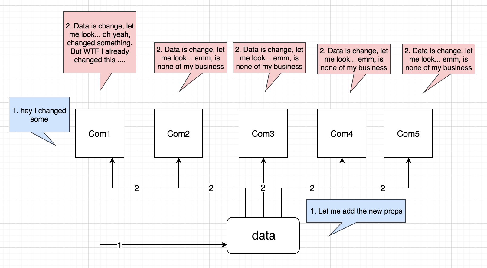
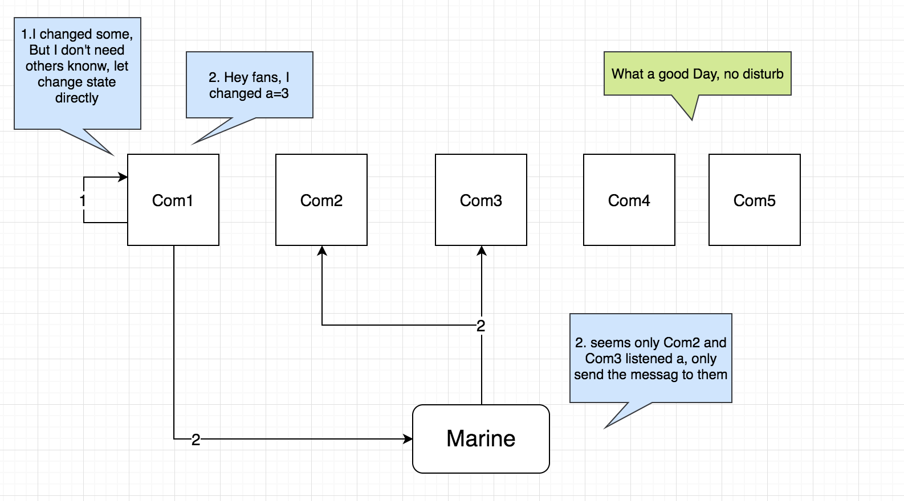

# Marine

[中文文档](README.md)

Marine is a minimalist implementation of Flux that simplifies the definition of Action and Store, optimizes methods for calling different Actions, and the flow of Store listen events.

[](https://travis-ci.org/zmofei/marine)
[](https://www.npmjs.com/package/marine)


## With so many similar libraries, why is there a Marine?


### 1. props vs state

Suppose we have such a Div in the page. We can modify the color, size, border, etc. of any information that can be described by CSS by mouse or code. We need to control the props by:

**Write all the properties in props and inherit all the properties of props in Div's Style.**


This will result in:

1. The data source is huge: we need to put all the modified properties on the props may be extremely large.
2. Excessive rendering process: Every time we modify any of the properties, we have to notify the data source, and then pass the props to the current module, and then perform secondary rendering. This is especially common in scenarios where the user can interact. Imagine dragging the position of the div. Each time the mousemove, the location is passed to the data source and then passed back to the current module via props.
3. Too many invalid notifications: If a data source becomes a props for multiple components, each component that modifies the data source needs to respond to changes in the props to determine if changes are needed.

Such a list of problems can make it difficult to control data in an interactive scenario. We need to think about the question: Does the property modification in each module need to notify the root data source? Do you need to know every relevant module?



In order to solve these problems, a good Pub/Sub can be solved. For example, we automatically listen to a channel during the initialization of each module, telling the channel what information I only accept, every time I receive new data, the information I will get will be in my own state, if I need to notify other The module modification can also be sent to the other party through this pipe. Marine does not need to notify the data source of every property change, which is the most basic implementation of Marine.



In Marine, each module can listen to the channel it wants to listen to. When there is an update in this channel, the module will receive it in the first time (and other channels will be automatically filtered by Marine to be quiet and not disturbed). ), while the module can send the necessary messages to a channel at any time if needed.

In Marine, modules only need to focus on their own data, process and receive their own related data, and notify other modules when necessary, and can successfully complete many tasks. We have designed a lot of super simple and efficient APIs to use, let's try it.


## Quick example

#### Step 1 Define Action

```javascript
// import  Action, Store
import { Action } from 'marine';

// Define an action named Demo
Action.def('Demo');
```

#### Step 2 listen for messages

We can listen to messages from Action on any page via Store.on

```javascript
// import  Action, Store
import { Store } from 'marine';

// Listen to the hello channel of the Demo Action
Store.on('Demo.hello', StoreDate =>{
    console.log(StoreDate.data)
});
```

#### step 3 分发消息

After the Action is defined, you can send a message via the Action[ActionName].emit method in any file.

```javascript
// import  Action, Store
import { Action } from 'marine';

// send message
Action.Demo.emit('hello', 'Hello Marine');

// After the message is distributed, all callbacks that are listening to the channel will be called.
// The console.log(StoreDate.data) of the second step after the trigger is triggered.
```

## Simple example

In addition to the quick example above, we can also specify the Action method via the regular Action.def method and call it via Action[ActionName][fnName]

#### 1. Definition Action

```javascript
// import Action, Store
import { Action, Store } from 'marine';

/**
  * Each Action has a name and multiple methods
  * Action can be defined by Action.def
  *
  * The name of the Action in the following example is ‘Demo’. It has a test method that can be called with Action.Demo.test() when called.
  */

Action.def('Demo', {
     // In the quick example, we don't have a way to define Demo.
     // Here we define the hello method via the Action method.
     'hello': (action, name) => {
         // The first parameter of the Action method is the action object, and the subsequent parameters are passed in by the user.
         action.emit({
             channel: 'homechannel',
             data: name || 'Mofei'
         });
         // Here we can also simply write action.emit('homechannel', name)
         // In the quick example, we got the action object through Action.Demo and then passed the message via the emit method, as follows:
         // Action.Demo.emit('hello', 'Hello Marine');
         // Actually this sentence is equivalent to Action.Demo.hello('Hello Marine'),
         // The Action.Demo.hello method is the hello method we now define.
         // Although this method is not as simple as a quick example, what is brought to us is that all Action methods can be defined in the same place for easy management.
     }
});
```

#### 2. Listening to the action through the Store

```javascript
// a.js

// import Action, Store
import { Action, Store } from 'marine';

/**
  * I want to listen to an event can be monitored through Store.on
  * on accepts 2 parameters, the first parameter is the channel you want to listen to, there are 3 cases below
  * 1. Listening to a channel under an Action, such as 'Demo.homechannel', will listen to events from the Action Demo homechannel channel.
  * 2. Listen to all channels under an Action, such as 'Demo', which will listen to all channel events under Demo.
  * 3. Listen to all channels under all Actions, omitting the first parameter, it will listen to all channel events under Demo.
  **/

// Listen to the test event
Store.on('Demo.homechannel', (data) => {
    // When you execute Action.Demo.homechannel(), you can receive it here.
    console.log(data);
});

// Listen to all channel events under Demo
Store.on('Demo', (data) => {
     // When you execute any channel under Action.Demo, you can receive it here.
     console.log(data);
});

// listen to all channels of all Actions
Store.on((data) => {
     // When you execute any channel under any Action, you can receive it here.
     console.log(data);
});
```

#### 3.Trigger events through Action in View
```javascript
// b.js

// import Action, Store
import { Action, Store } from 'marine';
/**
  * You want to call a method of an Action. After you have defined the related Action, you can call it directly through Action.[ActionName].[ActionFunction]
  **/

// Trigger the test event, at which point all three listeners in a.js can receive messages at the same time.
Action.Demo.test('I am Marine');

// In the quick example we are using
// Action.Demo.emit('hello', 'I am Marine')
// Omit the definition of the action method hello, but relatively increased the management cost of the action.
```

## API

### 1. Action

#### 1.1 Action.def(ActionName, ActionFunctions)

This method is used to define the Action, which is a syntactic sugar that quickly defines the Action.

##### 1.1.1 ActionName [String]

ActionName is the name of the currently created Action. After the declaration is completed, you can get the corresponding Action through `Action[ActionName]`.

For example, we declare an Action called Mofei (which will be introduced later in ActionFunctions):

```javascript
import { Action } from 'marine';

action.def('Mofei', ActionFunctions)
```

After the definition, you can get the Action object by introducing Action in any page and then calling Action.Mofei, for example:

```javascript
import { Action } from 'marine';

// At this point Action.Mofei is the Action we just defined via def.
console.log(Action.Mofei);
```

##### 1.1.2 ActionFunctions [Object]

Next, we introduce ActionFunctions, which are JSON type key-value pairs, where key is the method name of the current Action instance, and value is the specific Action method corresponding to the Function. In the Action instance method, the first parameter is our current Action instance object, for example

For example, in an Action named Mofei, we want to add 2 methods `coding` and `sleep`:

```javascript
import { Action } from 'marine';

// Define the Mofei instance, which can be obtained later via Action.Mofei
Action.def('Mofei', {
    // Define the instance method, which can be called later via Action.Mofei.coding('javascript')
    // The first instance of the instance method is automatically passed to the current Action instance, which is Action.Mofei,
    // The second parameter starts to customize the parameters passed in for the user.
    // For example, the second parameter here is the `javascirpt` in Action.Mofei.coding('javascript').
    coding: (action, language)=>{
        // In the instance method we can? Any method directly through Aciton
        // Here we call the emit method of the action
        action.emit({
            channel: 'coding',
            data: `I am coding with ${language}`
        })
    },
    sleep: (action,place)=>{
        action.emit({
            channel: 'coding',
            data: `I am sleeping at ${place}`
        })
    }
})
```

After the statement is completed, we can call the corresponding method through Action.Mofei, such as:

```javascript
// Introduce Action
import { Action } from 'marine';

Action.Mofei.coding('javascript');
Action.Mofei.sleep('home');
```

#### 1.1.3 Comparison of Action.def and new Action() methods.

In the above example, we quickly defined the Action instance through Action.def. If it is defined by Action.def, our writing should be as follows:

```javascript
let mofeiAction = new Action('Mofei');

let conding(language) => {
    mofeiAction.emit({
        channel: 'coding',
        data: `I am sleeping at ${place}`
    })
}

let sleep(palce) => {
    mofeiAction.emit({
        channel: 'coding',
        data: `I am sleeping at ${place}`
    })
}

export {coding, sleep};
```

We need to introduce `coding` or `sleep` when calling.

```javascript
import {coding, sleep} from 'path';

coding('javascript')
sleep('home')
```

Relatively, the instance method defined by def will automatically hang on the global variable of Action. You don't need to introduce specific methods in each page. Just introduce Marine Action and then use Action[ActionName][functionName]. Calling can improve a lot of development efficiency. For the traditional new Action method, you need to export these class methods and then import the method in the place you need to use it, which may be a little more troublesome.


#### 1.2 Action.coustructor(name)
#### 1.3 action.emit(emitParam)

Action.emit is used to distribute messages, and all events that listen to the channel being distributed can receive the message.

| Param | Type | Explain |
|:---:|:---:|:---:|
|emitParam.channel|[String]|Name of the distributed channel|
|emitParam.data|[Object]|Distributed data data|
|emitParam.stores|[Array]|Distributed to other store listeners, usually only the store listener with the same name can receive the message, after the store is specified, the message can be distributed to other stores, such as Robin|

Usage is as follows

```javascript
Action.def('Mofei', {
    Coding: (action, language)=>{
        // emit method
        action.emit({
            dhannel: 'coding',
            data: `I am coding with ${language}`,
            stores: ['Mofei', 'Robin']
        })
    }
});

// trigger
Action.Mofei.coding('javascript');

// At this point, all objects listening to the coding channel can get the message.
// Store.on('Mofei.coding', (data)=>{
// console.log(data)
//})

// Since the store:['Mofei', 'Robin'] is created above, Robin's listener can also receive the message.
// Store.on('Robin.coding', (data)=>{
// console.log(data)
//})
```

Or

```javascript
let Mofei = new Action('Mofei');
Mofei.emit({
    channel: 'coding',
    data: `I am coding with javascirpt`
})
```

**Syntactic sugar**

You can also use the action.echo(channel, data, options) to quickly call the echo method.

```JavaScript
action.emit({
    channel: 'coding',
    data: `I am coding with ${language}`,
    stores: ['Mofei', 'Robin']
})
```

Equivalent to

```JavaScript
action.emit('coding', `I am coding with ${language}`, {
    Stores: ['Mofei', 'Robin']
})
```

#### 1.4 action.echo(echoParam)
#### 1.5 action.[emit|echo].reduice(reduiceParam)
#### 1.6 action.[emit|echo].reduice(reduiceParam)
#### 1.7 action.[emit|echo].channel(channelNames) [String|Array]
#### 1.8 action.[emit|echo].stores(storesNames) [Array]


### 2. Store

#### 2.1 Store.on(ChannelName, callback)

#### 2.2 Store() 