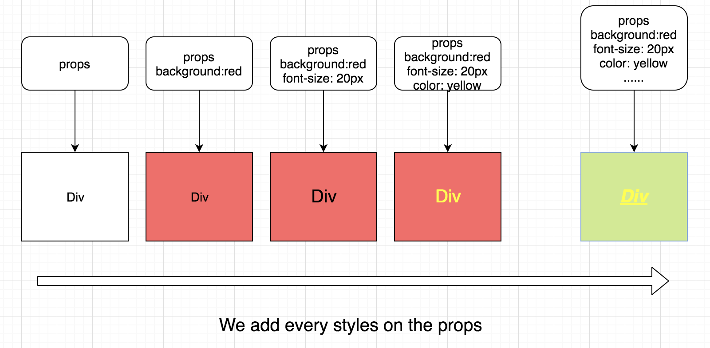
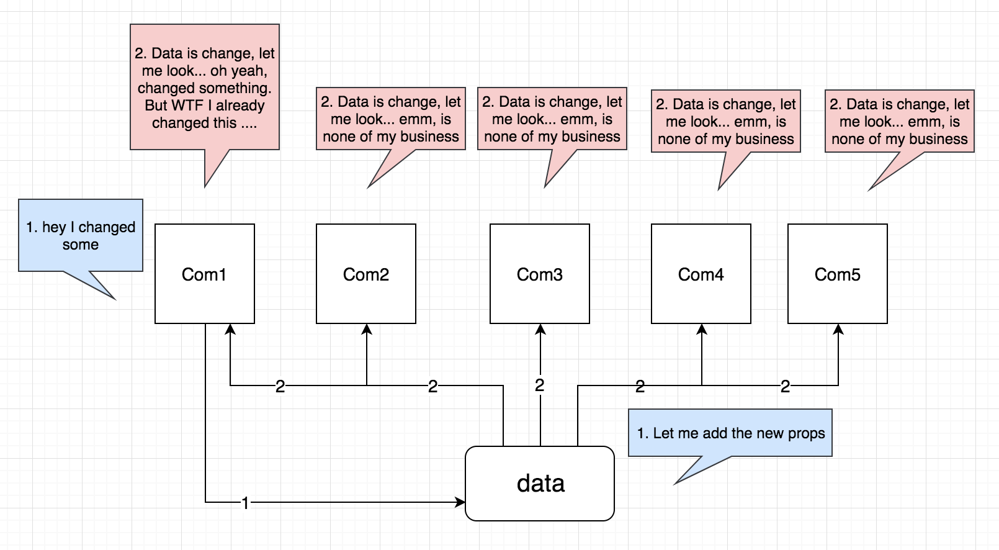
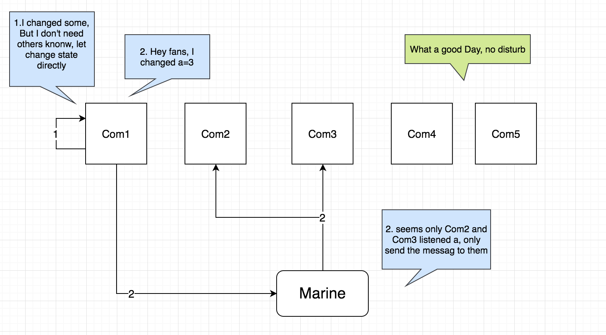

# Marine

Marine 是一个极简的Flux的实现，简化了Action和Store的定义，优化了调用不同Action的方法以及Store监听事件的流程。

[](https://travis-ci.org/zmofei/marine)
[](https://www.npmjs.com/package/marine)


## 有了React Redux为什么还要有Marine呢？


### 1. props vs state

假设我们在页面中有这样一个Div我们可以通过鼠标或者代码去修改他的颜色、大小、边框等任何可以通过CSS描述的信息，通过props我们需要样控制：

**把所有的属性写在props中，在Div的Style中继承props的所有属性**



这会导致：

1. 数据源庞大：我们需要将所有的修改属性都放在props上可能会异常的庞大。
2. 过多的渲染流程：每次修改任何一个属性我们都得通知到数据源上，然后再通过props传到当前的模块中，再进行二次渲染。这在用户可以交互的场景下尤为常见，试想一下拖动div的位置，每次mousemove的时候，都要把位置传给数据源然后再通过props传回到当前模块中。
3. 过多的无效通知：如果一个数据源成为了多个组件的props，每次修改数据源所有的组件都需要去响应这个props的改变去判断是否需要变化。

这样一些列的问题会使得在可交互场景下去控制数据变得十分困难，我们需要思考这样一个问题：每个模块中的属性修改是否需要通知根数据源？是否需要让每个相关的模块都知道呢？



为了解决这些问题，一个有好的Pub/Sub就能解决。比如我们在每个模块的初始化时候自动监听一个频道，告诉这个频道我只接受什么样的信息，每次接收到新的数据就将将拿到的信息都存在自己的state中，如果需要通知其他的模块修改某些东西也可以通过这个管道发送给对方。这就是Marine的最基本的实现。



在Marine中，每个模块都可以监听自己想要监听的频道，当这个频道中有更新时该模块会第一时间收到（而其他频道的消息会被Marine自动过滤掉以做到安静无打扰），同时模块如有需要也可以在任何时间向某个频道发送必要的消息。

在Marine中，模块只需要关注自己的数据(State)，处理和接收到的自己相关的数据，以及在必要的时候通知其他的模块，就可以顺利的完成很多任务。我们设计了很多超级简单高效的API可供使用，快来试试吧。


## 快速示例

#### step 1 定义Action

```javascript
// 引入  Action, Store
import { Action } from 'marine';

// 定义名为Demo的Action
Action.def('Demo');
```

#### step 2 监听消息

我们可以在任意页面通过Store.on来监听来自Action的消息

```javascript
// 引入  Action, Store
import { Store } from 'marine';

// 监听Demo Action的hello频道
Store.on('Demo.hello', StoreDate =>{
    console.log(StoreDate.data)
});
```

#### step 3 分发消息

定义了Action之后，可以在任意文件中通过 Action[ActionName].emit 方法发送消息

```javascript
// 引入  Action, Store
import { Action } from 'marine';

// 分发消息
Action.Demo.emit('hello', 'Hello Marine');

// 消息分发之后，所有监听了对于频道的回调都会被调用
// 这里触发之后第二步的 console.log(StoreDate.data) 就会被触发。
```

## 简单示例

除了上述的快速示例外，我们也可以通过常规的Action.def的方法指定Action方法，并通过Action[ActionName][fnName]去调用

#### 1. 定义 Action

```javascript
// 引入  Action, Store
import { Action, Store } from 'marine';

/**
 * 每个Action有一个名字，以及多个方法
 * Action可以通过Action.def定义
 * 
 * 下例中Action的名字是‘Demo’，它有一个test的方法，调用的时候，可以用通过 Action.Demo.test() 调用。 
 */

Action.def('Demo', {
    // 在快速示例中，我们没有定义Demo的方法
    // 这里我们通过Action方法来定义hello方法
    'hello': (action, name) => {
        // Action 方法的第一个参数是action对象，后续的参数为用户传递进来的参数
        action.emit({
            channel: 'homechannel',
            data: name || 'Mofei'
        });
        // 这里我们也可以简单的写成 action.emit('homechannel', name)
        // 在快速示例中，我们是通过 Action.Demo 获取到了 action 对象，然后通过emit方法传递消息, 如下：
        // Action.Demo.emit('hello', 'Hello Marine');
        // 其实这句话也等同于 Action.Demo.hello('Hello Marine')，
        // 其中的 Action.Demo.hello 方法就是我们现在定义的这个hello方法。
        // 虽然这种写法没有快速示例简单，但是带给我们的是可以在同一个地方定义所有的Action方法，方便管理
    }
});
```

#### 2. 通过Store监听Action

```javascript
// a.js

// 引入  Action, Store
import { Action, Store } from 'marine';

/**
 * 想要监听一个事件可以通过Store.on来监听
 * on接受2个参数，第一个参数是你要监听的频道，有下面的3中情况
 * 1. 监听某个Action下的某个频道，比如'Demo.homechannel'，会监听到来自Action Demo的homechannel频道的事件
 * 2. 监听某个Action下所有的频道，比如'Demo'，这样会监听到Demo下的所有的频道的事件
 * 3. 监听所有Action下所有的频道，省略第一个参数，就会监听到所有Demo下所有的频道的事件
 **/

// 监听test事件
Store.on('Demo.homechannel', (data) => {
    // 当执行Action.Demo.homechannel()时，此处就能接收到
    console.log(data);
});

// 监听Demo下所有的频道事件
Store.on('Demo', (data) => {
    // 当执行Action.Demo下的任何一个频道时，此处就能接收到
    console.log(data);
});

// 监听所有的Action的所有频道
Store.on((data) => {
    // 当执行任何一个Action下的任何一个频道时，此处就能接收到
    console.log(data);
});
```

#### 3.View中通过Action触发事件
```javascript
// b.js

// 引入 Action, Store
import { Action, Store } from 'marine';

/**
 * 想要调用某个Action的方法，在定了相关的Action之后，可以直接通过Action.[ActionName].[ActionFunction] 调用
 **/

// 触发test事件，此时a.js中的3个监听均能同时受到消息。
Action.Demo.test('I am Marine');

// 在快速示例中我们使用的是
// Action.Demo.emit('hello', 'I am Marine')
// 省略了action方法hello的定义，但是相对来说增加了action的管理成本。
```


## API

### 1. Action

#### 1.1 Action.def(ActionName, ActionFunctions)

该方法用以定义Action，是快速定义Action的语法糖。

##### 1.1.1 ActionName [String]

ActionName为当前创建的Action的名称，声明完成之后就可以通过 `Action[ActionName]` 来获取到对应的Action了。

例如我们声明一个名为 Mofei 的 Action，(其中的ActionFunctions我们随后就会介绍):

```javascript
import { Action } from 'marine';

Action.def('Mofei', ActionFunctions)
```

定义之后，就可以在任意的页面中通过引入Action，然后调用Action.Mofei获取到这个Action对象了,例如：

```javascript
import { Action } from 'marine';

// 此时Action.Mofei就是我们刚刚通过def定义的Action了。
console.log(Action.Mofei);
```

##### 1.1.2 ActionFunctions [Object]

接下来介绍一下ActionFunctions，ActionFunctions为JSON类型的键值对，其中key为当前Action实例的方法名称，value为Function对应的具体的Action方法。在Action实例方法中，`第一个参数就是我们当前的Action实例对象`，例如

例如在刚刚名为 Mofei 的 Action，我们想添加2个方法 `coding`和`sleep`:

```javascript
import { Action } from 'marine';

// 定义Mofei实例，后续可以通过 Action.Mofei获取该实例
Action.def('Mofei', {
    // 定义实例方法，后续可以通过 Action.Mofei.coding('javascript')调用该方法
    // 实例方法的第一个参会自动传入当前的Action实例，该处就是Action.Mofei，
    // 第二个参数开始为用户自定义传入的参数，
    // 比如这里的第二个参数language就是Action.Mofei.coding('javascript')中的`javascirpt`
    coding: (action, language)=>{
        // 实例方法中我们可以直接通过Aciton的任何方法
        // 这里我们调用了action的emit方法
        action.emit({
            channel: 'coding',
            data: `I am coding with ${language}`
        })
    },
    sleep: (action,place)=>{
        action.emit({
            channel: 'coding',
            data: `I am sleeping at ${place}`
        })
    }
})
```

声明完成之后我们就可以通过Action.Mofei调用对应的方法了，如：

```javascript
// 引入Action
import { Action } from 'marine';

Action.Mofei.coding('javascript');
Action.Mofei.sleep('home');
```

#### 1.1.3 Action.def 和 new Action() 方式对比。

上述实例中我们通过Action.def快速定义了Action实例，如果不同通过Action.def定义的话，我们的写法应该如下：

```javascript
let mofeiAction = new Action('Mofei');

let conding(language) => {
    mofeiAction.emit({
        channel: 'coding',
        data: `I am sleeping at ${place}`
    })
}

let sleep(palce) => {
    mofeiAction.emit({
        channel: 'coding',
        data: `I am sleeping at ${place}`
    })
}

export {coding, sleep};
```

调用的时候我们需要引入`coding` 或者 `sleep`

```javascript
import {coding, sleep} from 'path';

coding('javascript')
sleep('home')
```

相对比较起来通过def定义的实例方法会自动挂在到Action的全局变量上，你不需要在各个页面中引入具体的方法，只需引入Marine的Action，然后通过 Action[ActionName][functionName] 就可以调用，可以提高不少开发效率。而传统的new Action的方法，你则需要将这些类方法export出去，然后在需要用的地方import进来该方法，可能会稍许麻烦些。


#### 1.2 Action.coustructor(name)
#### 1.3 action.emit(emitParam)

action.emit 用于分发消息，所有监听被分发的频道的事件均能收到分发的消息。

| Param | Type | Explain |
|:---:|:---:|:---:|
|emitParam.channel|[String]|分发的channel的名称|
|emitParam.data|[Object]|分发的data数据|
|emitParam.stores|[Array]|分发到其他的Store监听上，通常只有同名的Store监听能收到消息，指定stores之后可以将消息分发到其他的Store上，如下面例子中的Robin|

用法如下

```javascript
Action.def('Mofei', {
    coding: (action, language)=>{
        // emit 方法
        action.emit({
            channel: 'coding',
            data: `I am coding with ${language}`,
            stores: ['Mofei', 'Robin']
        })
    }
});

// 触发
Action.Mofei.coding('javascript');

// 此时监听了coding频道的所有对象都能获得消息
// Store.on('Mofei.coding', (data)=>{
//    console.log(data)
//})

// 由于上面制定了stores:['Mofei', 'Robin']所以Robin的监听也能收到消息
// Store.on('Robin.coding', (data)=>{
//    console.log(data)
//})
```

or

```javascript
let Mofei = new Action('Mofei');
Mofei.emit({
    channel: 'coding',
    data: `I am coding with javascirpt`
})
```

**语法糖**

你也可以使用action.echo(channel, data, options)来快速调用echo方法

```JavaScript
action.emit({
    channel: 'coding',
    data: `I am coding with ${language}`,
    stores: ['Mofei', 'Robin']
})
```

等同于

```JavaScript
action.emit('coding', `I am coding with ${language}`, {
    stores: ['Mofei', 'Robin']
})
```


#### 1.4 action.echo(echoParam)
#### 1.5 action.[emit|echo].reduice(reduiceParam)
#### 1.6 action.[emit|echo].reduice(reduiceParam)
#### 1.7 action.[emit|echo].channel(channelNames) [String|Array]
#### 1.8 action.[emit|echo].stores(storesNames) [Array]


### 2. Store

#### 2.1 Store.on(ChannelName, callback)

#### 2.2 Store() 